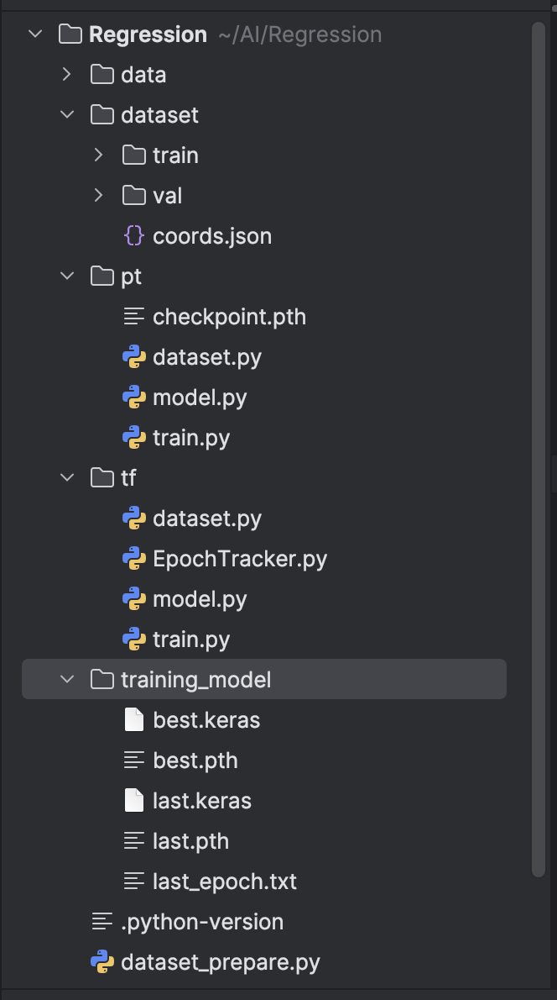
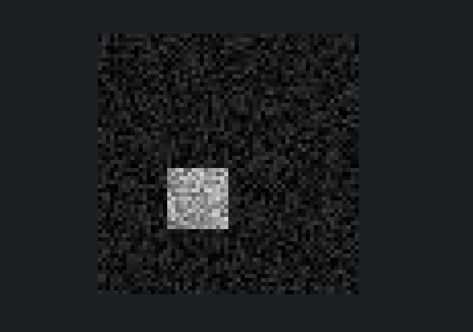

# 📦 Computer Vision demo

Simple demo of Machine Learning - regression. 
Neural network model predicts coords of the light rect center. 
Backbon implemented with simple CNN and head is implemented with Liner layers.


---

## 🚀 Features

- Pytorch. "pt" folder.
- Tensorflow. "tf" folder.
- Pillow. Working with images
- Numpy. To work with objects and arrays.
- Json. 
- Matplotlib. to visualize resaults 
- tqdm. to show progress bar for training process.
- CNN.
- Checkpoints. Used to restore last epoch if something happened within train process.
- ReduceLROnPlateau. Used to dynamically change Learning_rate.
- stop_counter. Used to stop training if training-metrics isn't improving. 

---

## 🖼 Screenshots

### Project files



### Training Source image



---

## 🛠 Setup

```bash

git clone https://github.com/genry86/SimpleRegressionDemo.git
cd SimpleRegressionDemo
pip3 install -r requirements.txt
python dataset_prepare.py # to generate training images

Use "pt" folder to work with pytorch. 
User "tf" to work with tensorflow.
